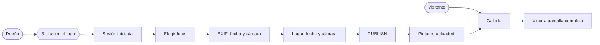
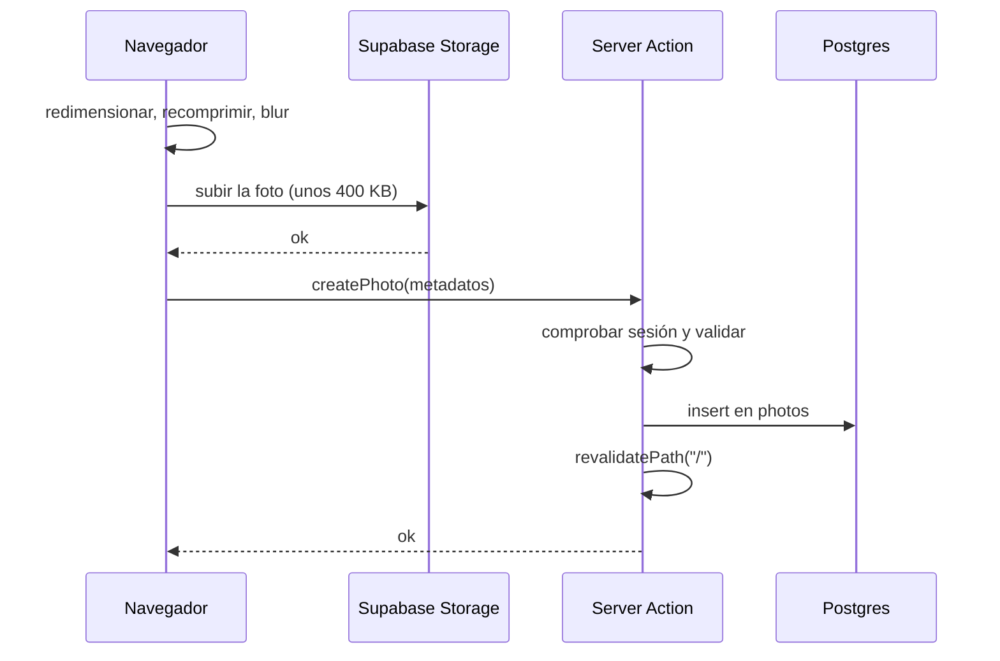
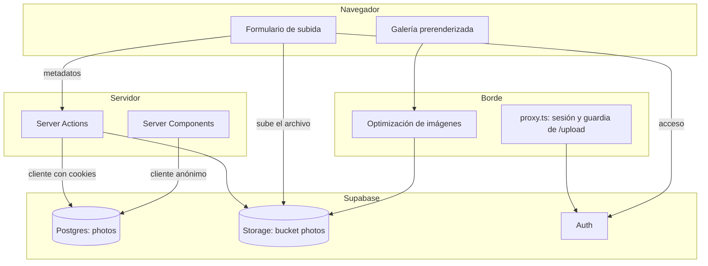
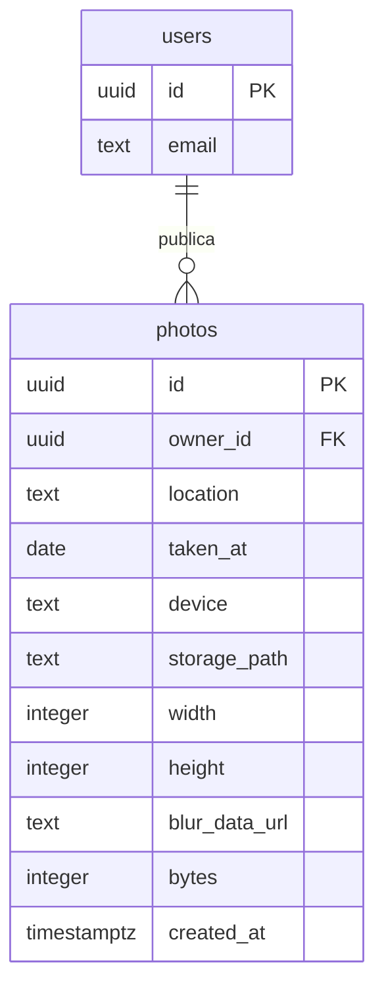

<div align="center">

<picture>
  <source media="(prefers-color-scheme: dark)" srcset="docs/logo-dark.svg">
  
</picture>

# THIRD EYE

**Use your third eye. To look at the world around you.**
Portafolio de fotografía: galería pública, subida privada desde el móvil y un pipeline que comprime cada foto en el navegador antes de que toque el servidor.

[](https://nextjs.org)
[](https://react.dev)
[](https://www.typescriptlang.org)
[](https://tailwindcss.com)
[](https://supabase.com)
[](https://thirdeye.santiagofuenmayorruiz.com)

</div>

> Proyecto personal de Santiago Fuenmayor Ruiz. Vive en un subdominio del portafolio, pero es una aplicación independiente: no comparte código, diseño ni proyecto de Vercel con él.

## Contenido

- [Qué es](#qué-es)
- [Funcionalidades](#funcionalidades)
- [Flujo de uso](#flujo-de-uso)
- [Cómo se procesan las fotos](#cómo-se-procesan-las-fotos)
- [Stack](#stack)
- [Arquitectura](#arquitectura)
- [Modelo de datos](#modelo-de-datos)
- [Seguridad](#seguridad)
- [Puesta en marcha](#puesta-en-marcha)
- [Variables de entorno](#variables-de-entorno)
- [Scripts](#scripts)
- [Despliegue](#despliegue)
- [Estructura del repositorio](#estructura-del-repositorio)
- [Decisiones de diseño](#decisiones-de-diseño)

## Qué es

Una galería de fotografía de una sola persona. Cualquiera puede verla; solo su dueño puede publicar en ella, y lo hace desde el móvil con el que hizo las fotos: elegir imágenes, escribir dónde se tomaron y pulsar `PUBLISH`.

El problema que resuelve no es mostrar fotos —eso lo hace cualquier plantilla— sino **hacerlo sin que el sitio se vuelva pesado ni el almacenamiento se llene**. Una foto de un iPhone ronda los 2-3 MB; cincuenta serían 150 MB y una galería lenta. Aquí cada imagen se redimensiona y se recomprime **en el navegador de quien la sube**, antes de viajar: el servidor nunca ve el archivo original, se guarda una sola versión de unos 400 KB, y las medidas concretas que pide cada pantalla las genera Vercel al vuelo.

De paso, ese procesado borra los metadatos EXIF. La localización que aparece bajo cada foto es la que se escribe a mano, nunca las coordenadas que llevaba el archivo.

## Funcionalidades

| Área | Qué ofrece |
|---|---|
| **Galería pública** | Cuadrícula de fotos con lugar, fecha de captura y cámara. En escritorio todas las teselas miden lo mismo; en móvil cada foto se ve a su proporción. |
| **Visor** | Pantalla completa con la foto sin recortar, navegable con `←` `→` y cerrable con `Esc`. |
| **Acceso oculto** | La galería no enseña ningún enlace de administración: tres clics seguidos sobre el logo llevan al acceso. |
| **Subida** | Varias fotos por tanda, arrastrando o desde el selector, con vista previa y progreso por foto. |
| **Autocompletado** | La fecha y la cámara se rellenan solas leyendo el EXIF del archivo; el lugar se sugiere entre los ya usados. |
| **Borrado** | Sobre cada foto, con sesión iniciada. Elimina la fila y el archivo de Storage, y refresca la galería al instante. |
| **Contador de uso** | La pantalla de subida muestra cuántas fotos hay y cuánto ocupan. |

## Flujo de uso



1. El visitante entra y ve la cuadrícula; al pulsar una foto se abre a pantalla completa.
2. El dueño hace tres clics sobre el logo y entra con su correo y contraseña.
3. Elige una o varias fotos: la fecha y la cámara se rellenan solas desde el EXIF.
4. Escribe el lugar y pulsa `PUBLISH`. Las fotos se procesan y suben una a una.
5. La pantalla de confirmación devuelve a la galería, ya actualizada.

## Cómo se procesan las fotos

Todo el trabajo pesado ocurre en el navegador de quien sube, en [`src/lib/image.ts`](src/lib/image.ts):

1. Se decodifica el archivo aplicando la orientación EXIF, para que una foto vertical no acabe tumbada.
2. Se reduce **en pasos de mitad de tamaño** hasta 3000 px de lado mayor. Un único `drawImage` con un factor de reducción grande deja la imagen con aliasing.
3. Se recomprime a WebP con calidad 0.85, o a JPEG si el navegador no sabe codificar WebP (Safari anterior a 16.4).
4. Se genera un placeholder borroso de 12 px como data URL —unos 0,8 KB— que viaja en el HTML y evita el salto de layout mientras carga la foto.

Medido sobre imágenes reales:

| Entrada | Se guarda | Peso | Tiempo |
|---|---|---|---|
| 2250×4000 (vertical) | 1688×3000 | 164 KB | 524 ms |
| 4032×3024 (horizontal) | 3000×2250 | 429 KB | 738 ms |

Con fotos de cámara y mucho detalle el resultado ronda entre 400 KB y 1 MB, así que el gigabyte gratuito de Supabase da para unas mil.

Los archivos van directos del navegador a Storage; la fila de metadatos se escribe después, ya en el servidor:



Si el `insert` falla después de haber subido el archivo, la acción `discardUploads` borra el huérfano de Storage.

**Los tamaños de entrega los genera Vercel.** `next/image` pide exactamente los píxeles que necesita cada pantalla y los sirve en AVIF: la cuadrícula de un móvil recibe unos 1080 px de ancho, una tesela de escritorio unos 640, el visor hasta 2048. Por eso no se guarda una miniatura aparte.

## Stack

| Capa | Tecnología |
|---|---|
| Framework | [Next.js](https://nextjs.org) 16.2.10 (App Router, `src/app`, Turbopack) |
| Interfaz | [React](https://react.dev) 19.2.4 + [Tailwind CSS](https://tailwindcss.com) 4.3.3 |
| Lenguaje | [TypeScript](https://www.typescriptlang.org) 5.9.3 |
| Datos | [Supabase](https://supabase.com) Postgres con RLS (tabla `photos`) |
| Archivos | Supabase Storage (bucket público `photos`) |
| Autenticación | Supabase Auth con [`@supabase/ssr`](https://supabase.com/docs/guides/auth/server-side) 0.12.7, una sola cuenta |
| Alojamiento | [Vercel](https://vercel.com), proyecto propio en subdominio |

## Arquitectura



Tres particularidades que no se deducen del diagrama:

- **`proxy.ts`, no `middleware.ts`.** En Next.js 16 el *middleware* pasó a llamarse proxy. Solo se ejecuta en `/upload` y `/login`.
- **La galería no lee cookies.** [`getPhotos()`](src/lib/photos.ts) usa un cliente de Supabase anónimo y sin sesión, así que `/` se prerenderiza y se sirve desde el CDN.
- **Los controles de dueño se deciden en cliente.** Sobre ese HTML, idéntico para todo el mundo, [`useIsOwner()`](src/lib/use-owner.ts) decide si mostrar el botón de subir y los de borrar.

### Rutas

| Ruta | Qué es | Acceso |
|---|---|---|
| `/` | Galería, cuadrícula y visor | Pública, prerenderizada, revalida cada 60 s |
| `/login` | Correo y contraseña | Pública, sin enlaces entrantes |
| `/upload` | Subida y confirmación | Solo con sesión |

## Modelo de datos

Una sola tabla: los archivos viven en Storage y aquí solo están sus metadatos.



| Columna | Para qué |
|---|---|
| `owner_id` | Dueño de la fila. Por defecto `auth.uid()`; es sobre lo que actúan las políticas RLS. |
| `location` | Lo que se escribe a mano, `Barcelona, ES`. Entre 1 y 80 caracteres. |
| `taken_at` | Fecha de captura, leída del EXIF. Se guarda como `date`, sin hora ni huso. |
| `device` | Modelo de la cámara, también del EXIF, `iPhone 17 Pro`. Opcional. |
| `storage_path` | Ruta dentro del bucket, `<uuid>/full.webp`. |
| `width`, `height` | Dimensiones de lo guardado; reservan el espacio de la foto antes de que cargue. |
| `blur_data_url` | Placeholder borroso de 12 px embebido en el HTML. |
| `bytes` | Lo que ocupa, para el contador de la pantalla de subida. |

El esquema completo, con índices y políticas, está en [`supabase/schema.sql`](supabase/schema.sql) y es idempotente: se puede volver a ejecutar tantas veces como haga falta.

## Seguridad

- **RLS en las dos superficies.** `photos` y `storage.objects` permiten lectura a cualquiera y escritura solo a un usuario autenticado; borrar y actualizar exigen además `auth.uid() = owner_id`.
- **Las server actions comprueban la sesión.** Son endpoints `POST` públicos, así que [`src/app/actions.ts`](src/app/actions.ts) verifica el usuario y valida cada campo —formato de las rutas de Storage, longitud del lugar, fechas plausibles— además de lo que ya impone RLS.
- **Doble puerta en `/upload`.** El proxy corta el paso sin sesión y la página vuelve a comprobarlo en el servidor, por si algún día cambia el *matcher*.
- **El registro público se desactiva en Supabase.** Es lo que impide que un desconocido se cree una cuenta y, con ella, permiso de escritura.
- **Las fotos se publican sin EXIF.** Repintarlas en un canvas elimina los metadatos, incluida la geolocalización.
- **El bucket acota lo que acepta**: 15 MB por archivo y solo `image/webp` o `image/jpeg`.

La clave `anon` de Supabase es pública por diseño —viaja en el JavaScript del sitio— y no concede nada por sí sola: quien decide es RLS.

## Puesta en marcha

**Requisitos:** Node.js 20.9 o superior y una cuenta de Supabase.

### 1. Instala las dependencias

```bash
git clone https://github.com/santifuenma/THIRD-EYE.git
cd THIRD-EYE
npm install
```

### 2. Crea el proyecto de Supabase y ejecuta el esquema

En el panel de Supabase: **New project** y, cuando termine de aprovisionarse, **SQL Editor** → pega [`supabase/schema.sql`](supabase/schema.sql) entero → **Run**. Crea la tabla `photos`, el bucket `photos` y todas las políticas.

### 3. Crea tu usuario y cierra el registro

1. **Authentication → Users → Add user**: tu correo y una contraseña, marcando *Auto Confirm User*.
2. **Authentication → Sign In / Providers → Email**: desactiva **Allow new users to sign up**.

⚠️ El segundo paso no es opcional: con el registro abierto, cualquiera puede crearse una cuenta y las políticas RLS le darán permiso para publicar.

### 4. Configura las variables

```bash
cp .env.example .env.local
```

Rellena `NEXT_PUBLIC_SUPABASE_URL` y `NEXT_PUBLIC_SUPABASE_ANON_KEY` con los valores de **Project Settings → API Keys**.

### 5. Arranca

```bash
npm run dev
```

En `http://localhost:3000` está la galería. Tres clics en el logo llevan al acceso.

## Variables de entorno

| Variable | Obligatoria | Descripción |
|---|:---:|---|
| `NEXT_PUBLIC_SUPABASE_URL` | Sí | URL del proyecto de Supabase. Sin ella la galería se muestra vacía y el acceso no funciona. |
| `NEXT_PUBLIC_SUPABASE_ANON_KEY` | Sí | Clave pública, `anon` o *publishable*. Nunca la `service_role`: esa se salta RLS y la aplicación no la necesita. |
| `NEXT_PUBLIC_SITE_URL` | En producción | Dominio público, para los metadatos y las tarjetas de Open Graph. |

## Scripts

| Comando | Acción |
|---|---|
| `npm run dev` | Servidor de desarrollo en el puerto 3000 |
| `npm run build` | Compilación de producción |
| `npm run start` | Sirve la compilación |
| `npm run lint` | ESLint |
| `npm run typecheck` | `tsc --noEmit` |
| `npm run logo` | Regenera el componente del logo y el favicon desde `public/logo.svg` |

## Despliegue

Proyecto propio en Vercel, importando el repositorio. Next.js se detecta solo.

1. **Settings → Environment Variables**: las tres variables, con `NEXT_PUBLIC_SITE_URL` apuntando al dominio de producción. Se inyectan durante la compilación, así que al cambiarlas hay que volver a desplegar.
2. **Settings → Domains**: añade el subdominio. Si el dominio raíz ya está en la misma cuenta de Vercel se configura solo; si el DNS vive fuera, hay que crear el `CNAME` que indique el panel.
3. **Supabase → Authentication → URL Configuration**: pon el mismo dominio como *Site URL*.

La optimización de imágenes de Vercel cuenta las imágenes fuente, una vez al mes por foto, sin importar cuántos tamaños se deriven de ella. Si alguna vez estorba, `images.unoptimized: true` en [`next.config.ts`](next.config.ts) la desactiva y sirve los originales tal cual.

## Estructura del repositorio

```
src/
├─ app/
│  ├─ actions.ts           # server actions: crear, borrar y limpiar huérfanos
│  ├─ layout.tsx           # fuente, metadatos y tema claro
│  ├─ globals.css          # tokens de marca y utilidades propias
│  ├─ page.tsx             # galería pública (prerenderizada, 60 s)
│  ├─ login/               # formulario de acceso
│  └─ upload/              # subida y pantalla de confirmación
├─ components/
│  ├─ gallery.tsx          # cuadrícula, borrado y estado de archivo perdido
│  ├─ lightbox.tsx         # visor a pantalla completa
│  ├─ logo.tsx             # generado por npm run logo
│  ├─ secret-entrance.tsx  # los tres clics del logo
│  ├─ site-header.tsx      # cabecera con el claim
│  ├─ site-footer.tsx      # firma centrada
│  └─ owner-bar.tsx        # acceso a /upload con sesión iniciada
├─ lib/
│  ├─ image.ts             # redimensionado y compresión en el navegador
│  ├─ exif.ts              # lector de fecha y cámara, sin dependencias
│  ├─ dates.ts             # formato "September, 12th, 2026"
│  ├─ photos.ts            # consultas de la galería
│  ├─ use-owner.ts         # ¿hay sesión en este navegador?
│  └─ supabase/            # clientes: navegador, servidor y anónimo
└─ proxy.ts                # refresco de sesión y guardia de /upload

scripts/build-logo.mjs     # public/logo.svg a componente y favicon
supabase/schema.sql        # tabla, bucket y políticas RLS
```

## Decisiones de diseño

- **Una sola versión de cada foto.** Guardar además una miniatura era guardar una copia peor de algo que Vercel ya sabe hacer, y limitaba la calidad de la cuadrícula. Un único original de 3000 px alimenta todos los tamaños.
- **El procesado ocurre en el navegador.** Sube menos, el servidor no manipula imágenes y las server actions se libran del límite de tamaño por petición. El coste es depender de `canvas`, que en Safari anterior a 16.4 no codifica WebP: ahí cae a JPEG.
- **La galería se prerenderiza y no lee cookies.** Es HTML idéntico para todo el mundo, servido desde el CDN. Los controles de dueño se resuelven en cliente para no romper esa condición.
- **El acceso se hace desde el navegador.** Es el comportamiento por defecto de `@supabase/ssr`: la cookie de sesión la escribe el cliente y la lee el servidor. A cambio de no ser `httpOnly`, permite que la galería siga siendo cacheable.
- **Un error de consulta no se convierte en galería vacía.** `getPhotos()` deja subir el fallo en lugar de devolver una lista vacía; así Next sigue sirviendo la última versión buena y lo reintenta, en vez de cachear una página vacía como si fuera correcta.
- **La cuadrícula recorta, el visor no.** En escritorio todas las teselas son 3:4 con `object-cover` para que la retícula sea regular aunque las fotos no lo sean; la foto completa está a un clic.
- **Las fechas se formatean partiendo la cadena.** Un `new Date("2026-09-12")` se interpreta como UTC y en husos negativos mostraría el día 11.
- **El acceso está escondido, no protegido por oscuridad.** Los tres clics evitan enlaces de administración en una galería que quiere estar limpia; quien protege de verdad es Supabase Auth y RLS.

---

<div align="center">

**THIRD EYE** · Fotografías de Santiago Fuenmayor Ruiz

[thirdeye.santiagofuenmayorruiz.com](https://thirdeye.santiagofuenmayorruiz.com)

</div>
